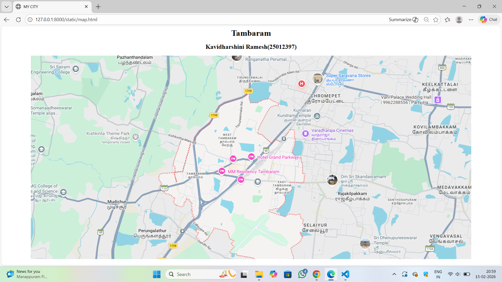

# Ex03 Places Around Me
## Date: 

## AIM
To develop a website to display details about the places around my house.

## DESIGN STEPS

### STEP 1
Create a Django admin interface.

### STEP 2
Download your city map from Google as an image.

### STEP 3
Insert the image using `````` tag and link it to the map.

### STEP 4
Using ```<map>``` tag name the map.

### STEP 5
Create clickable regions in the image using ```<area>``` tag.

### STEP 6
Write HTML programs for all the regions identified.

### STEP 7
Execute the programs and publish them.

## CODE

## map.html
```
<html>
<head>
    <title>MY CITY</title>
</head>
<body>
    <center>
        <h1>Tambaram</h1>
        <h2>Kavidharshini Ramesh(25012397)</h2>
    </center>


    <center>
    

<map name="image-map">
    <area target="" alt="Krishkinta Theme Park" title="Krishkinta Theme Park" href="krishkintathemepark.html" coords="438,276,192,349" shape="rect">
    <area target="" alt="Mudichur" title="Mudichur" href="mudichur.html" coords="325,564,75" shape="circle">
    <area target="" alt="selaiyur" title="selaiyur" href="selaiyur.html" coords="1003,689,997,620,1144,610,1155,680,1082,726" shape="poly">
    <area target="" alt="Chromepet" title="Chromepet" href="chromepet.html" coords="1030,142,1027,208,1198,198,1188,130" shape="poly">
    <area target="" alt="Perungalathur" title="Perungalathur" href="perungalathur.html" coords="379,643,391,731,545,709,532,620" shape="poly">
</map>
</center>
</body>
</html>
```
## chromepet.html
```
<html>
    <head>
        <title>CHROMEPET</title>
    </head>
    <center>
    <body bgcolor="lightblue">
        <h1>CHROMEPET</h1>
        <h3><p>
            Chromepet is a bustling residential and commercial suburb in southern Chennai, located on the Grand Southern Trunk (GST) Road, approximately 22 km from Chennai Central. Known as a prominent hub, it features excellent connectivity via rail and road, close proximity to the airport (4 km), and is home to the prestigious Madras Institute of Technology (MIT). 
        </p></h3>

    </body>
    </center>
</html>
```
## krishkinta theme park.html
```
<html>
<head>
    <title>Krishkinta Theme Park</title>
</head>
<center>
<body bgcolor="yellow">
    <h1>Krishkinta Theme Park</h1>
    <h3><p>Kishkinta Theme Park is a popular 120-acre amusement park located in Varadarajapuram, approximately 5 km from the Tambaram Railway Station in Chennai. Known for being one of India's first theme parks (opened in 1995), it features a blend of dry rides, water attractions, and scenic landscapes. 

    </p></h3>

    
</body>
</center>
</html>
```
## mudichur.html
```
<html>
<head>
    <title>Mudichur</title>
</head>
<center>
<body bgcolor="lightgreen">
    <h1>Mudichur</h1>
    <h3><p>Mudichur is a rapidly growing, affordable residential locality in South Chennai (Tambaram Corporation) known for its proximity to the Outer Ring Road (ORR) and excellent connectivity to GST Road. It offers a mix of apartments and independent houses, with increasing popularity due to nearby IT hubs, schools, and the newly opened Kilambakkam bus terminus. However, the area is prone to significant waterlogging during monsoon seasons. 
    </p></h3>

    
</body>
</center>
</html>
```
## perungalathur.html
```
<html>
<head>
    <title>Mudichur</title>
</head>
<center>
<body bgcolor="pink">
    <h1>Perungalathur</h1>
   <h3><p>Perungalathur is a rapidly developing, well-connected suburb in South Chennai, located on the NH45 highway between Tambaram and Vandalur. It acts as a major gateway to Chennai for traffic from southern Tamil Nadu, offering robust suburban rail, road, and upcoming metro connectivity. It features a mix of residential areas, IT parks, and, it is known for temples and nearby lakes. 
    </p></h3> 

    
</body>
</center>
</html>
```
## selaiyur.html
```
<html>
<head>
    <title>Mudichur</title>
</head>
<center>
<body bgcolor="aquablue">
    <h1>Selaiyur</h1>
   <h3><p>Selaiyur is a rapidly developing, primarily residential locality in South Chennai, situated along the Tambaram–Velachery Road within the Tambaram Municipal Corporation. Known for its peaceful environment and excellent connectivity to major areas like Tambaram and the airport, it has become a popular, mid-segment residential hub for families and professionals. 
    </p></h3> 

    
</body>
</center>
</html>
```

## OUTPUT


## RESULT
The program for implementing image maps using HTML is executed successfully.
